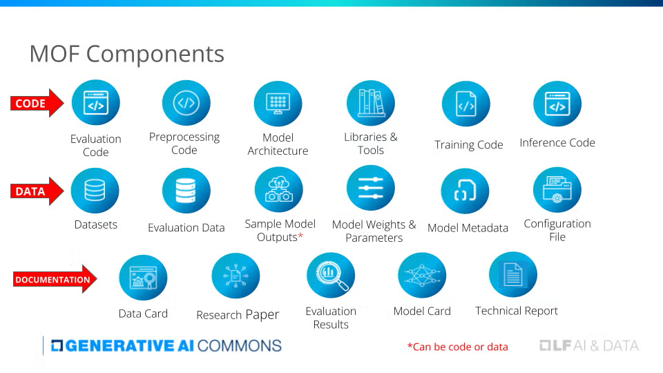

===================================
Model Openness Framework (MOF)
===================================

Task Description
====================
The Model Openness Framework (MOF) is a comprehensive system for evaluating
and classifying the completeness and openness of machine learning models,
with a strong focus on licensing requirements. By defining 17 distinct
components across a model’s lifecycle, MOF promotes transparency, reproducibility,
and responsibility in open-source machine learning. Each MOF component has
specific licensing criteria to ensure that contributors uphold intellectual
property rights while enabling open collaboration.

   MOF Components

In this task, we test the ability of large language models (LLMs) to
accurately answer licensing-related questions under MOF. The task comprises
three subtasks:

Subtasks
--------
1. **License Abbreviations**  
   - Expand or interpret short license abbreviations.  

2. **License OSI Approval**  
   - Determine whether a given license is approved by the Open Source Initiative (OSI) or not.  

3. **Question Answering**  
   - Provide detailed answers about licensing requirements in MOF.

Input Format
----------------
Each subtask will present a primary request in the form of:

- **Primary Request**:  
  A concise query about licensing in MOF, such as:
  
  - *"Expand the following MOF-related abbreviation into its full form: AFL-3.0"*
  - *"Is the Microsoft Shared Source License OSI-approved?"*
  - *"What type of license is the Apache License, Version 2.0?"*

- **Content**:  
  If necessary, relevant reference text (e.g., snippets from the OSI website, MOF documentation).  
  However, many prompts may not include separate content if the request is self-contained.

Output Format
----------------
The model should output:

- **Concise Answer**:  
  A short, direct response that addresses the primary request.  
- **Optional Explanation** (for Q&A subtask):  
  An additional sentence or two that justifies the answer, referencing MOF or OSI guidelines if needed.

Example Input-Output
--------------------

**Subtask 1: License Abbreviations**

**Input**  
::

   "Expand the abbreviation: BSD-3-Clause"

**Expected Output**  
::

   "BSD 3-Clause License"

**Subtask 2: License OSI Approval**

**Input**  
::

   "Is the Apache License 2.0 OSI-approved?"

**Expected Output**  
::

   "Yes"

**Subtask 3: Question Answering**

**Input**  
::

   "Which licenses are recommended for model parameters under the Model Openness Framework?"

**Expected Output**  
::

   "MOF recommends OSI-approved licenses (e.g., MIT License or Apache License 2.0) 
   for model parameters to ensure community collaboration and openness."

Dataset
=======
The dataset covers real-world and simulated licensing scenarios under MOF:

- **License Abbreviations** (41 items)  
  Expand or interpret short license labels (e.g.,AAL ).

- **License OSI Approval** (50 items)  
  Determine whether each license is officially approved by the Open Source Initiative.

- **Question Answering** (70 items)  
  Answer more in-depth questions about licensing requirements for specific MOF components
  (e.g., model parameters, datasets, or source code).

.. list-table::
   :header-rows: 1

   * - **Data**
     - **Size**
     - **Data Source**
   * - License Abbreviations
     - 41
     - OSI website
   * - License OSI Approval
     - 50
     - OSI website
   * - Question Answering
     - 70
     - OSI website, MOF docs
   * - **Total**
     - **161**
     - 

Data Usage
----------
Users can:

- Fine-tune or evaluate LLMs using this dataset.
- Combine OSI references and MOF documentation for improved factual accuracy.
- Enhance the model’s capability to address specialized licensing questions by including additional open-source knowledge bases, if desired.

Metrics
=======
Two metrics are used to evaluate performance:

1. **Accuracy**  
   For the **License Abbreviations** and **License OSI Approval** subtasks, the model’s output is compared to a ground-truth label. 
   Accuracy is computed as:

   .. math::

      \text{Accuracy} = \frac{\text{Number of Correct Predictions}}{\text{Total Number of Predictions}}

2. **FActScore**\ :sup:`[1]`  
   For the **Question Answering** subtask, FActScore measures factual precision. 
   A higher FActScore indicates that the model’s answers align more closely with MOF guidelines
   and reference materials, while a lower score suggests factual inaccuracy.

Below are evaluation results for three baseline models across the three subtasks in MOF Licenses.

.. list-table::
   :header-rows: 1
   :widths: 30 20 20 20 20

   * - **Baseline Model**
     - **Average Score**
     - **License Abbreviations (Accuracy)**
     - **License OSI Approval (Accuracy)**
     - **Detailed QA (FActScore)**
   * - Llama 3.1-8B
     - 0.5149
     - 0.1290
     - 0.7200
     - 0.6956
   * - GPT-4o
     - 0.6564
     - 0.1935
     - 0.9600
     - 0.8156
   * - Mistral Large 2
     - 0.4640
     - 0.1290
     - 0.4400
     - 0.8229

These baseline results serve as benchmarks for evaluating new model submissions on the MOF Licenses task.

References
==========
[1] Sewon Min et al. (2023). *FactScore: Fine-grained atomic evaluation of factual precision in 
long-form text generation.* arXiv preprint arXiv:2305.14251.  
Available at: `https://arxiv.org/abs/2305.14251 <https://arxiv.org/abs/2305.14251>`_

.. note::

   For additional details on MOF’s 17 components and specific licensing criteria, see 
   White et al. (2024), *Model Openness Framework (MOF)*, as cited in competition
   documentation or `MOF official docs <https://arxiv.org/abs/2403.13784>`_.

